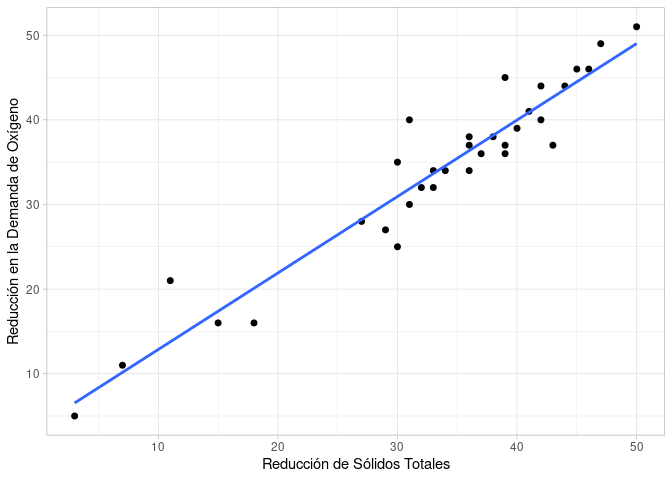
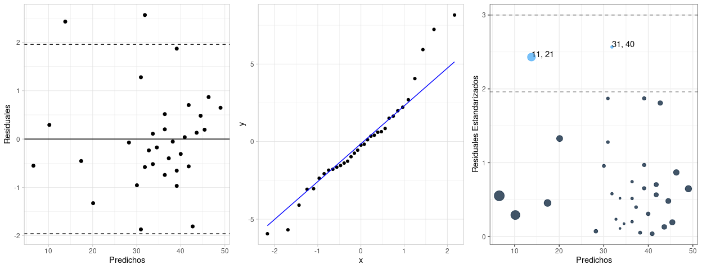
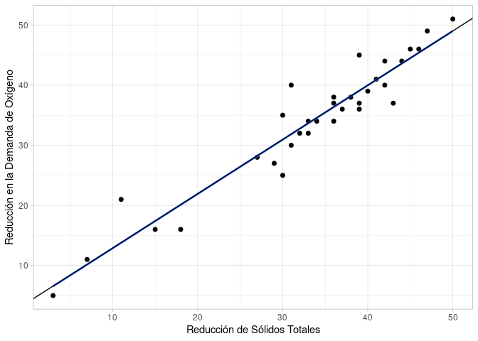
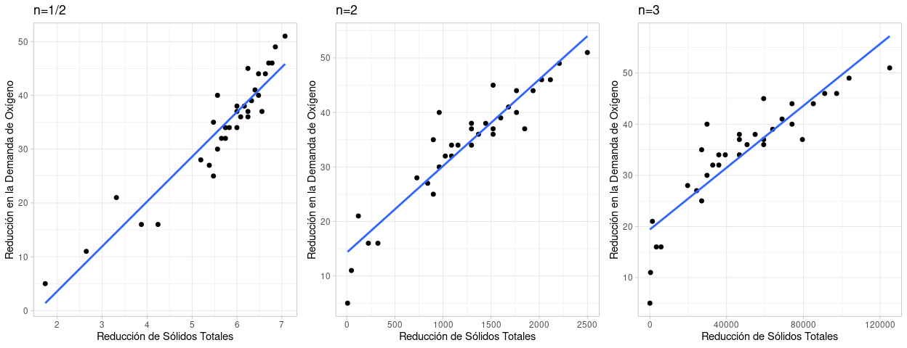
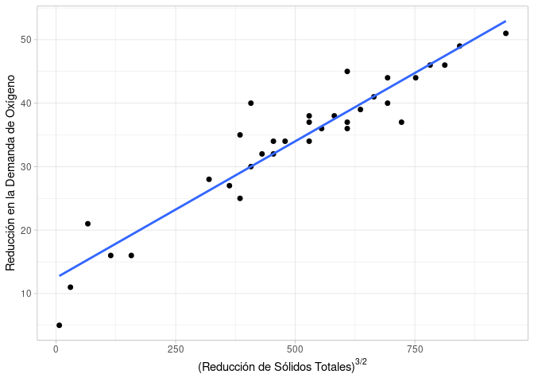
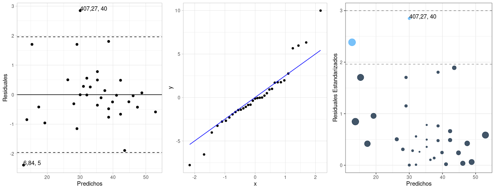

# Primera tarea práctica: Regresión lineal.

### Marcelo Molinatti

## Regresión lineal simple.

Considere los datos experimentales de la tabla, que se obtuvieron de $n=33$ muestras de desechos tratados químicamente en un estudio realizado en _Virginia Tech_. Se registraron los valores de _x_, la reducción porcentual de los sólidos totales, y de _y_, el porcentaje de disminución de la demanda de oxígeno químico.


Al inspeccionar dicho diagrama se observa que los puntos se acercan mucho a una línea recta, lo cual indica que la suposición de linealidad entre las dos variables parece ser razonable y el sl modelo seleccionado para el análisis.


```r
ggplot(df_RLS, aes(x=solid_reduction, y=oxigen_reduction)) +
	geom_point(size=1.8) +
	geom_smooth(method=lm, se=FALSE) + 
	xlab("Reducción de Sólidos Totales") + ylab("Reducción en la Demanda de Oxígeno") +
	theme_light()
```

<div class="figure" style="text-align: center">

<p class="caption">Reducción de la demanda de oxigeno con respecto a la reducción de sólidos totales.</p>
</div>

Ajustamos un modelo de regresión lineal simple de la forma $y = \beta_0 + \beta_1 x$, para poder estimar los coeficientes del modelo de regresión $\beta_0$ y $\beta_1$


```r
fit <- lm(oxigen_reduction ~ solid_reduction, df_RLS)

as_tibble(summary(fit)$coefficients) |>
	tibble::add_column(term=c("Reducción de Sólidos", "Residuales"), .before=1) |>
	kable(digits=3, row.names=FALSE, booktabs=TRUE,
		col.names=c("", "Estimado, $\\hat{\\beta}$", "Desv. Estándar", "$\\hat{t}$", "$P(t > \\hat{t})$"), 
		caption="Resultados de la regresion lineal simple.",
		escape=FALSE, label="pRLS-01", format.args = list(big.mark=".")) %>%
	kable_classic(position = "center", latex_options = "hold_position")
```

\begin{table}[!h]

\caption{\label{tab:pRLS-01}Resultados de la regresion lineal simple.}
\centering
\begin{tabular}[t]{lrrrr}
\toprule
 & Estimado, $\hat{\beta}$ & Desv. Estándar & $\hat{t}$ & $P(t > \hat{t})$\\
\midrule
Reducción de Sólidos & 3,830 & 1,768 & 2,166 & 0,038\\
Residuales & 0,904 & 0,050 & 18,030 & 0,000\\
\bottomrule
\end{tabular}
\end{table}

Como se observa, ambos estimadores (del coeficiente y de la pendiente) son significativamente distintos de cero, dado el valor de probabilidad asociado para el estadístico $\hat{t}$ que indica que una desviación tan grande solo por azar es improbable. Este estadístico busca contrastar las hipótesis $H_0: \beta_i = 0$ contra la alternativa $H_1: \beta_i \ne 0$ para cada $i=0, 1$. Como la probabilidad asociada es muy pequeña, se concluye que la probabilidad de que $\hat{\beta}_i \sim N(0, \sigma_{\beta_i})$ es muy baja y que estos deben venir de alguna otra distribución con media distinta de cero.  
Otra forma de validar el modelo de regresión es comparando el modelo planteado con un modelo nulo que no incluye pendiente (es decir, que no incluye la relación lineal con la variable independiente $x$), utilizando una prueba $F$ como se muestra en la tabla \ref{tab:pRLS-04}. 


```r
broom::tidy(aov(fit)) |>
	mutate(term=c("Reducción de Sólidos", "Residuales")) |>
	kable(digits=3, row.names=FALSE, booktabs=TRUE,
		col.names=c("", "df", "SS", "MS", "$\\hat{F}$", "$P(F > \\hat{F})$"), 
		caption="\\label{tab:pRLS-04}Tabla ANOVA para validar el modelo de regresión.",
		escape=FALSE, format.args = list(big.mark=".")) %>%
	kable_classic(position = "center", latex_options = "hold_position")
```

\begin{table}[!h]

\caption{\label{tab:pRLS-04}\label{tab:pRLS-04}Tabla ANOVA para validar el modelo de regresión.}
\centering
\begin{tabular}[t]{lrrrrr}
\toprule
 & df & SS & MS & $\hat{F}$ & $P(F > \hat{F})$\\
\midrule
Reducción de Sólidos & 1 & 3.390,551 & 3.390,551 & 325,08 & 0\\
Residuales & 31 & 323,327 & 10,430 &  & \\
\bottomrule
\end{tabular}
\end{table}

De la tabla se observa que al comparar las varianza del modelo con pendiente y el modelo nulo (solo intercepto), se obtiene un valor de $F$ mucho mas grande que el que se esperaría por azar, y es por ello que se le asocia una probabilidad aproximadamente nula (a 4 espacios decimales, el valor es cero). Esto no da la confianza de escoger el modelo de regresión como un buen modelo de trabajo que permite describir los datos observados, y realizar predicciones. De hecho, es posible calcular y obtener una medida de asociación entre las variables, $R^2$, cuyo valor es 0,9101324, el cual nos permite concluir que el modelo es capaz de explicar un 91% de la varianza observada.

Sin embargo, aun es necesario validar las suposiciones del modelo de regresión, verificando lo valores residuales. Los gráficos mostrados en la figura \ref{fig:pRLS-05} muestran que los residuales no tienen un comportamiento normal: es fácil ver del _QQ-plot_ que varias observaciones se desvían mas de los esperado, tanto por encima como por debajo. 
El gráfico de residuales a la izquierda muestra que aun se percibe cierto grado de linealidad entre los valores esperados y los residuales, y permite constatar la presencia de al menos dos residuales que se desvían mas de dos desviaciones estándar de la media de cero. 
El tercer gráfico (a la derecha) muestra la información del gráfico de residuales, pero donde cada punto se ha escalado en tamaño usando como factor la influencia que cada punto tiene sobre la estimación. Se puede observar, que las observaciones asociadas a valores grandes o pequeños de sólidos totales tienen la mayor influencia y que uno de los atípicos tiene una gran influencia en la recta estimada.


```r
augmented_fit <- broom::augment(fit)

cowplot::plot_grid(
	ggplot(augmented_fit, aes(x=.fitted, y=.std.resid)) +
		geom_point(size=1.8) +
		xlab("Predichos") + ylab("Residuales") +
		geom_hline(yintercept=c(0, -1.96, 1.96), linetype=c(1, 2, 2)) + 
		theme_light(),
	ggplot(augmented_fit, aes(sample = .resid)) + 
		stat_qq() + 
		stat_qq_line(color="blue") + 
		theme_light(),
    ggplot(mutate(augmented_fit, .too.large=ifelse(abs(.std.resid) > 1.96, 1, 0)), 
    		aes(x = .fitted, y = abs(.std.resid))) +
    	geom_point(aes(colour = .too.large, size=.hat * 100), alpha = .8) + 
    	geom_hline(yintercept = c(1.96, 3), linetype = 2, col = c("gray60", "gray50")) + 
    	xlab("Predichos") + ylab("Residuales Estandarizados") +
    	theme_bw() +
    	theme(legend.position="none") +
    	geom_text(aes(label=ifelse(.std.resid > 1.96, as.character(paste(solid_reduction, oxigen_reduction, sep=", ")), '')), 
    		hjust=0, vjust=0),
	nrow=1)
```



Dado estos resultados, se concluye que el problema no parece ser que el modelo sea incorrecto, sino que no se esta tomando en cuenta la influencia que cada observación (particularmente los atípicos) tienen sobre la estimación de los coeficientes. Es por ello que, en lugar de una transformación de los datos, se prefirió realizar una regresión de mínimos cuadrados ponderados.

### Segundo intento: Mínimos Cuadrados Ponderados.

Se realizó una regresión de mínimos cuadrados ponderados, usando como pesos la varianza residual estimada de cada una de las observaciones:

$$w_i = \frac{1}{\hat{\sigma^2}(1 - h_{ii})}$$

donde $h_{ii}$ es la palanca (_leverage_) de la $i$-esima observación. Realizando la regresión ponderada usando estos pesos arroja los resultados mostrados en la tabla \ref{tab:pRLS-06}, donde se observa el cambio ligero en los coeficientes (los cuales aun siguen siendo significativos): aumento de la pendiente y caída del intercepto. 


```r
fit2 <- lm(oxigen_reduction ~ solid_reduction, df_RLS, 
	weights=1 / (broom::glance(fit)$sigma ** 2 * (1 - augmented_fit$.hat)))

as_tibble(summary(fit2)$coefficients) |>
	tibble::add_column(term=c("Reduccion de Solidos", "Residuales"), .before=1) |>
	kable(digits=3, row.names=TRUE, 
		col.names=c("", "Estimado, $\\hat{\\beta}$", "Desv. Estándar", "$\\hat{t}$", "$P(t > \\hat{t})$"), booktabs=TRUE,
		escape=FALSE, label="tab:pRLS-06", format.args = list(big.mark="."),
		caption="\\label{tab:pRLS-03}Resultados de la regresión lineal ponderada.") %>%
	kable_classic(position = "center", latex_options = "hold_position")
```

\begin{table}[!h]

\caption{\label{tab:tab:pRLS-06}\label{tab:pRLS-03}Resultados de la regresión lineal ponderada.}
\centering
\begin{tabular}[t]{llrrrr}
\toprule
  &  & Estimado, $\hat{\beta}$ & Desv. Estándar & $\hat{t}$ & $P(t > \hat{t})$\\
\midrule
1 & Reduccion de Solidos & 3,869 & 1,672 & 2,314 & 0,027\\
2 & Residuales & 0,903 & 0,048 & 18,900 & 0,000\\
\bottomrule
\end{tabular}
\end{table}

El modelo nuevo, sigue siendo significativo al compararlo con el modelo nulo, e incluso el error cuadrado medio es 10 veces menor en el modelo de regresión ponderado (resultados no mostrados). La superposición de la nueva recta permite darnos cuenta que la mejora no es muy grande, y que la ponderación solo resulta en un aumento de 0,744% en la varianza explicada (aunque el $R^2$ deja de ser una medida de asociación confiable en este caso).


Sin embargo, otras medidas de bondad de ajuste como el $AIC$ y $BIC$ resultaron ser mayores que los obtenidos para el modelo sin ponderación, de forma que el ajuste ponderado no es preferible al modelos de regresión lineal simple ajustado la primera vez.


```r
ggplot(df_RLS, aes(x=solid_reduction, y=oxigen_reduction)) +
	geom_point(size=1.8) +
	geom_smooth(method=lm, se=FALSE) + 
	geom_abline(slope=coef(fit2)[[2]], intercept=coef(fit2)[[1]]) + 
	xlab("Reducción de Sólidos Totales") + ylab("Reducción en la Demanda de Oxígeno") +
	theme_light()
```



### Tercer intento: Transformación tentativa por polinomios.

Al revisar con mayor cuidado el gráfico de dispersión de los datos, se puede notar cierta curvatura al incrementar la reducción de sólidos totales (particularmente, los datos agrupados a magnitudes grandes de ```solid_reduction``` parecen seguir una recta distinta a la cual se accede siguiendo una curva tangente a esta y a una recta distinta que pasa por los datos agrupados para magnitudes pequeñas de ```solid_reduction```).  
Debido a esto, procedí a construir los gráficos mostrados en la figura \ref{fig:pRLS-09}, los cuales muestran la la relación entre la reducción en la demanda de oxígeno, ```oxigen_reduction```, con respecto a polinomios de la reducción de sólidos totales, ```solid_reduction```, de la forma $x^n$, para $n=1/2, 2, 3$. 


```r
cowplot::plot_grid(
	ggplot(df_RLS, aes(x=solid_reduction ** (1/2), y=oxigen_reduction)) +
		geom_point(size=1.8) +
		geom_smooth(method=lm, se=FALSE) + 
		xlab("Reducción de Sólidos Totales") + ylab("Reducción en la Demanda de Oxígeno") +
		labs(title="n=1/2") +
		theme_light(),
	ggplot(df_RLS, aes(x=solid_reduction ** 2, y=oxigen_reduction)) +
		geom_point(size=1.8) +
		geom_smooth(method=lm, se=FALSE) + 
		xlab("Reducción de Sólidos Totales") + ylab("Reducción en la Demanda de Oxígeno") +
		labs(title="n=2") +
		theme_light(),
	ggplot(df_RLS, aes(x=solid_reduction ** 3, y=oxigen_reduction)) +
		geom_point(size=1.8) +
		geom_smooth(method=lm, se=FALSE) + 
		xlab("Reducción de Sólidos Totales") + ylab("Reducción en la Demanda de Oxígeno") +
		labs(title="n=3") +
		theme_light(),
	nrow=1)
```



Los gráficos muestran en todos los casos una curvatura: en el caso de $n=1/2$ la curvatura es convexa siguiendo algún polinomio de grado entero mayor a 1, mientras que las correspondiente a $n=2$ y $n=3$ la curvatura es cóncava y parece seguir la forma de una función con $n=1/2$. Combinando esta información, se decidió realizar una transformación de la variable independiente de la forma $p/q$ como modelo alternativo. Esta elección la hice de forma arbitraria basándome solo en los tres casos mostrados en la figura \ref{fig:pRLS-09}, pero luego determiné el coeficiente de Box-Cox el cual arrojó un valor de 1,7979798, el cual esta bastante cercano al valor de $7/4$.


```r
ggplot(df_RLS, aes(x=solid_reduction ** (7/4), y=oxigen_reduction)) +
	geom_point(size=1.8) +
	geom_smooth(method=lm, se=FALSE) + 
	xlab(expression("(Reducción de Sólidos Totales)" ** "3/2")) + 
	ylab("Reducción en la Demanda de Oxígeno") +
	theme_light()
```



Ajustamos un modelo de regresión lineal simple de la forma:

$$y = \beta_0 + \beta_1 x^{7/4}$$

para poder estimar los coeficientes del modelo de regresión $\beta_0$ y $\beta_1$


```r
df_RLS |> 
    mutate(solid_transformed=solid_reduction ** (7/4)) -> df_RLS

fit3 <- lm(oxigen_reduction ~ solid_transformed, df_RLS)

as_tibble(summary(fit3)$coefficients) |>
	tibble::add_column(term=c("Intercepto", "Reducción de Sólidos"), .before=1) |>
	kable(digits=3, row.names=FALSE, booktabs=TRUE,
		col.names=c("", "Estimado, $\\hat{\\beta}$", "Desv. Estándar", "$\\hat{t}$", "$P(t > \\hat{t})$"), 
		caption="Resultados de la regresion lineal simple.",
		escape=FALSE, label="pRLS-11", format.args = list(big.mark=".")) %>%
	kable_classic(position = "center", latex_options = "hold_position")
```

\begin{table}[!h]

\caption{\label{tab:pRLS-11}Resultados de la regresion lineal simple.}
\centering
\begin{tabular}[t]{lrrrr}
\toprule
 & Estimado, $\hat{\beta}$ & Desv. Estándar & $\hat{t}$ & $P(t > \hat{t})$\\
\midrule
Intercepto & 12,483 & 1,475 & 8,462 & 0\\
Reducción de Sólidos & 0,043 & 0,003 & 16,130 & 0\\
\bottomrule
\end{tabular}
\end{table}

Al igual que antes, se observa que ambos coeficientes son significativos y el modelo parece explicar la relación entre las variables. Sin embargo, se necesita saber si el nuevo modelo es significativamente distinto del modelo de regresión sin transformar, y validarlo, verificando el comportamiento de los residuales. Esta claro, al observar la tabla \ref{tab:pRLS-12} que en términos de las medidas de bondad de ajuste, el modelo sin transformar es preferible; aunque la discrepancia entre ambos es muy pequeña.


```r
broom::glance(fit) |>
	bind_rows(broom::glance(fit3)) |>
	mutate(SSE=sigma ** 2 * df.residual, MSE=sigma ** 2) |>
	select(SSE, df.residual, MSE, adj.r.squared, AIC, BIC) |>
	tibble::add_column(Model=c("Reg. Lin.", "Reg. Lin. Transf"), .before=1) |>
	kable(digits=3, row.names=FALSE, booktabs=TRUE,
		col.names=c("", "SSE", "df", "MSE", bquote("R" * "2"), "AIC", "BIC"), 
		caption="\\label{tab:pRLS-12}Tabla ANOVA para validar el modelo de regresion.",
		escape=FALSE, format.args = list(big.mark=".")) %>%
	kable_classic(position = "center", latex_options = "hold_position")
```

\begin{table}[!h]

\caption{\label{tab:pRLS-12}\label{tab:pRLS-12}Tabla ANOVA para validar el modelo de regresion.}
\centering
\begin{tabular}[t]{lrrrrrr}
\toprule
 & SSE & df & MSE & "R" * "2" & AIC & BIC\\
\midrule
Reg. Lin. & 323,327 & 31 & 10,430 & 0,91 & 174,961 & 179,451\\
Reg. Lin. Transf & 395,415 & 31 & 12,755 & 0,89 & 181,603 & 186,093\\
\bottomrule
\end{tabular}
\end{table}

Por otro lado, al revisar los gráficos de residuales (figura \ref{fig:pRLS-13}), esta claro que el comportamiento de los mismo es mucho mejor al rededor de la media; aunque se destaca la presencia de un mayor número de datos atípicos y con desviaciones importantes. Parece entonces que la distribución subyacente de los residuales sea una distribución de colas mas pesadas que la normal. 


```r
augmented_fit3 <- broom::augment(fit3)

cowplot::plot_grid(
	ggplot(augmented_fit3, aes(x=.fitted, y=.std.resid)) +
		geom_point(size=1.8) +
		xlab("Predichos") + ylab("Residuales") +
		geom_hline(yintercept=c(0, -1.96, 1.96), linetype=c(1, 2, 2)) + 
		theme_light() +
		geom_text(aes(label=ifelse(.std.resid > 1.96, as.character(paste(round(solid_transformed, 2), oxigen_reduction, sep=", ")), '')), 
    		hjust=0, vjust=0) + 
		geom_text(aes(label=ifelse(.std.resid < -1.96, as.character(paste(round(solid_transformed, 2), oxigen_reduction, sep=", ")), '')), 
    		hjust=0, vjust=0),
	ggplot(augmented_fit3, aes(sample = .resid)) + 
		stat_qq() + 
		stat_qq_line(color="blue") + 
		theme_light(),
    ggplot(mutate(augmented_fit3, .too.large=ifelse(abs(.std.resid) > 1.96, 1, 0)), 
    		aes(x = .fitted, y = abs(.std.resid))) +
    	geom_point(aes(colour = .too.large, size=.hat * 100), alpha = .8) + 
    	geom_hline(yintercept = c(1.96, 3), linetype = 2, col = c("gray60", "gray50")) + 
    	xlab("Predichos") + ylab("Residuales Estandarizados") +
    	theme_bw() +
    	theme(legend.position="none") +
    	geom_text(aes(label=ifelse(.std.resid > 1.96, as.character(paste(round(solid_transformed, 2), oxigen_reduction, sep=", ")), '')), 
    		hjust=0, vjust=0),
	nrow=1)
```




```r
sessionInfo()
```

```
## R version 4.2.2 Patched (2022-11-10 r83330)
## Platform: x86_64-pc-linux-gnu (64-bit)
## Running under: Ubuntu 20.04.6 LTS
## 
## Matrix products: default
## BLAS:   /usr/lib/x86_64-linux-gnu/blas/libblas.so.3.9.0
## LAPACK: /usr/lib/x86_64-linux-gnu/lapack/liblapack.so.3.9.0
## 
## locale:
##  [1] LC_CTYPE=en_US.UTF-8       LC_NUMERIC=C              
##  [3] LC_TIME=es_VE.UTF-8        LC_COLLATE=en_US.UTF-8    
##  [5] LC_MONETARY=es_VE.UTF-8    LC_MESSAGES=en_US.UTF-8   
##  [7] LC_PAPER=es_VE.UTF-8       LC_NAME=C                 
##  [9] LC_ADDRESS=C               LC_TELEPHONE=C            
## [11] LC_MEASUREMENT=es_VE.UTF-8 LC_IDENTIFICATION=C       
## 
## attached base packages:
## [1] stats     graphics  grDevices utils     datasets  methods   base     
## 
## other attached packages:
## [1] cowplot_1.1.1    broom_1.0.1      dplyr_1.0.10     ggplot2_3.3.6   
## [5] kableExtra_1.3.4
## 
## loaded via a namespace (and not attached):
##  [1] tinytex_0.42      bslib_0.4.1       tidyselect_1.2.0  xfun_0.34        
##  [5] purrr_0.3.5       splines_4.2.2     lattice_0.20-45   colorspace_2.0-3 
##  [9] vctrs_0.5.0       generics_0.1.3    htmltools_0.5.3   viridisLite_0.4.1
## [13] yaml_2.3.6        mgcv_1.8-41       utf8_1.2.2        rlang_1.0.6      
## [17] jquerylib_0.1.4   pillar_1.8.1      glue_1.6.2        withr_2.5.0      
## [21] DBI_1.1.3         lifecycle_1.0.3   stringr_1.4.1     munsell_0.5.0    
## [25] gtable_0.3.1      rvest_1.0.3       evaluate_0.17     labeling_0.4.2   
## [29] knitr_1.40        fastmap_1.1.0     fansi_1.0.3       highr_0.9        
## [33] scales_1.2.1      backports_1.4.1   cachem_1.0.6      jsonlite_1.8.3   
## [37] webshot_0.5.4     farver_2.1.1      systemfonts_1.0.4 digest_0.6.30    
## [41] stringi_1.7.8     grid_4.2.2        cli_3.4.1         tools_4.2.2      
## [45] sass_0.4.2        magrittr_2.0.3    tibble_3.1.8      tidyr_1.2.1      
## [49] pkgconfig_2.0.3   MASS_7.3-58.2     Matrix_1.5-1      xml2_1.3.3       
## [53] assertthat_0.2.1  rmarkdown_2.17    svglite_2.1.0     httr_1.4.4       
## [57] rstudioapi_0.14   R6_2.5.1          nlme_3.1-162      compiler_4.2.2
```
